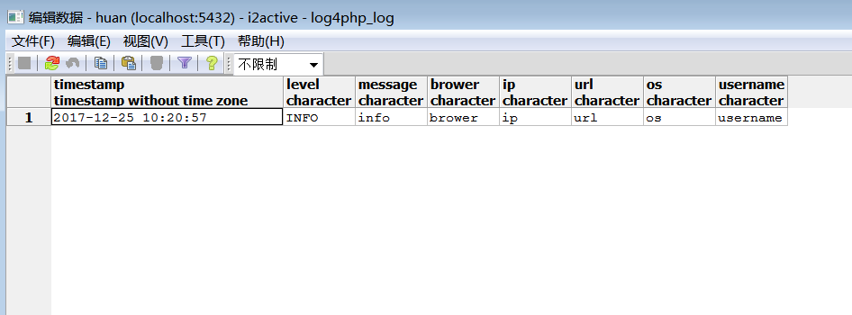
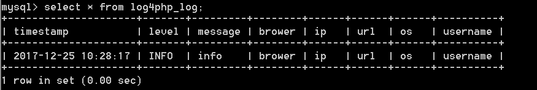

自定义log4php_log表结构修改   log4php/appenders/LoggerAppenderPDO.php

```
protected $insertSQL = "INSERT INTO __TABLE__ (timestamp,ip,url, brower,level, message,os,username) VALUES (?,?, ?, ?, ?, ?,?,?)";

protected function format(LoggerLoggingEvent $event) {
	$msg = $event->getMessage();
	$params = array();
	$params[] = date('Y-m-d H:i:s', $event->getTimeStamp());
	$params[] = $msg['ip'];
	$params[] = $msg['url'];
	$params[] = $msg['brower'];
	$params[] = $event->getLevel();
	$params[] = $msg['info'];
	$params[] = $msg['os'];
	$params[] = $msg['username'];
	return $params;
}
  
```  
  

PostgreSQL测试



mysql测试


